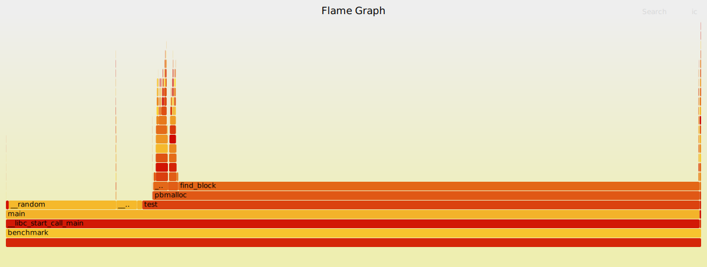
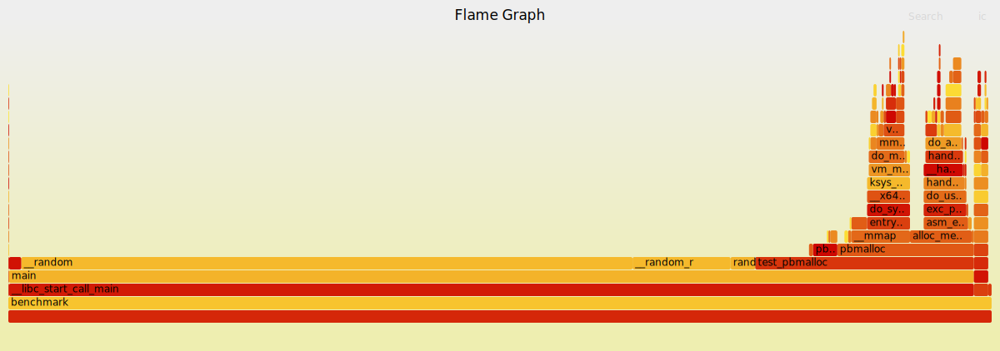

# pbmalloc

Malloc implementation using sbrk or mmap

## sbrk implementation
Simple first-fit algorithm that extends data-segment.

## mmap implementation
MMap allocates at least page size of memory. First implementation used a first-fit algorithm within a bin-list. However, finding a free block was a bottleneck.

Changed the implementation to use the bin-list as a free-list, making it much faster

