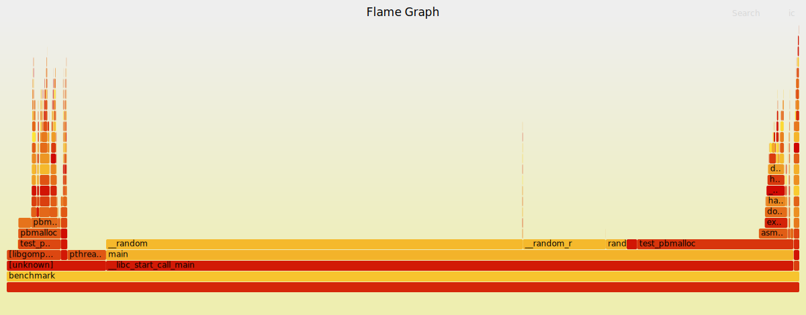

# pbmalloc

Malloc implementation using sbrk or mmap

## sbrk implementation
Simple first-fit algorithm that extends data-segment.

## mmap implementation
MMap allocates at least page size of memory. First implementation used a first-fit algorithm within a bin-list. However, finding a free block was a bottleneck.

Changed the implementation to use the bin-list as a free-list, making it much faster

## thread-safe implementation
Each thread has an arena. The implementation is the same as the previous one but an extra step to acquire/release the arena.
Each arena has a mutex lock and they are stored in a shared linked list called `arena_list`. Mutating this list or calling syscalls requires a mutex lock.

## profiling
Profiled code using [benchmark](benchmark.c) file with **perf** and [Brendan Gregg's Flamegraph tooling](https://www.brendangregg.com/FlameGraphs/cpuflamegraphs.html#Problem)
